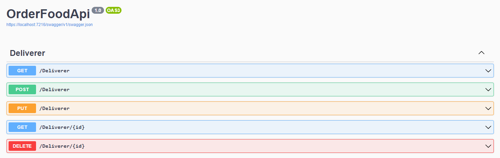

# Aplikacji API imitująca aplikację do zamawiania jedzenia

Zdjęcia ze SawggerUI:

# Jak uruchomić?

1. Należy sklonować repository na swój komputer

2. Jeżeli używamy windowsa to w pliku docker-compose.yml należy zamienić dominikpietek/sql na dominikpietek/sql:win

2. W głównym folderze należy otworzyć terminal

3. W terminalu wywołać komendę: docker-compose up

4. Aplikacja zostanie uruchomiona na: http://localhost:8080

5. Z racji, że jest to typ Release to nie będzie widoczny swagger, więc można uzyc jakiegoś interpertera jak np: Postman